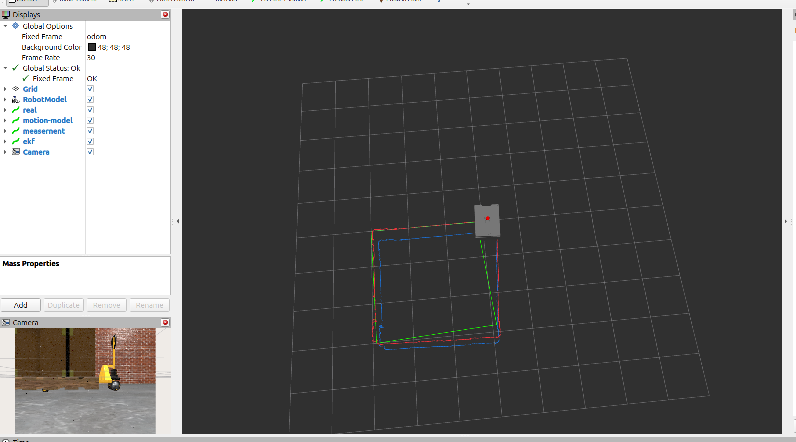

<div align="center">
  
  <br><br>
  <h1 align="center">Robotics Practical Assignments: EKF Sensor Fusion</h1>
</div>

---

### :dart: About This Repository

This repository hosts a series of practical assignments for the **Robotics** course (Sharif University of Technology).

**Assignment 2** focuses on implementing an **Extended Kalman Filter (EKF)** from scratch in ROS 2 (Python) to achieve robust robot localization by fusing data from multiple sensors. The implementation follows the standard EKF prediction-correction loop.

* **Objective:** Implement a custom EKF node to fuse Odometry (Wheel Encoders), Visual Odometry (VO), and IMU Yaw into a single, reliable state estimate.
* **State Vector:** $\mathbf{x} = [x, y, \theta]^T$ (Position and Yaw).
* **Environment:** ROS 2 (Jazzy/Humble) running on Ubuntu.

---

### :robot: Core Implementation: Assignment 2 (EKF Sensor Fusion)

The project consists of three main custom ROS 2 nodes, designed to operate in parallel, enabling the data fusion process:

#### 1. :wheel: `prediction_node.py` (Motion Model)
* **Role:** Provides the *a priori* state estimate (Prediction Step).
* **Input:** Linear and angular velocities (Twist) from the wheel odometry source.
* **Function:** Implements the kinematic model of the differential drive robot to calculate state changes ($\Delta x, \Delta y, \Delta \theta$) and publishes the raw wheel odometry.
* **Output:** `Odometry` message on `/wheel_odom/odom` (Prediction).

#### 2. :satellite: `measurement_node.py` (Sensor Preprocessing)
* **Role:** Prepares the combined sensor reading for the EKF Correction Step.
* **Input:** Raw high-rate sensor readings, specifically the position components ($X, Y$) from Visual Odometry (VO) and the orientation component ($\theta$) from the IMU.
* **Function:** Creates a unified `Odometry` message containing the sensor measurements ($Z$) and, crucially, sets the **Measurement Noise Covariance Matrix ($\mathbf{R}$)** based on sensor uncertainties or defined parameters.
* **Output:** `Odometry` message on `/ekf/measurement` containing $X, Y, \theta$ and the $6 \times 6$ covariance matrix $\mathbf{R}$.

#### 3. :brain: `ekf_node.py` (Fusion Core)
* **Role:** Executes the main filtering logic, fusing the Prediction and the Measurement.
* **Function:** Implements the core EKF algorithm:
    * **Prediction Step:** Uses the Prediction input to calculate the predicted state ($\mathbf{x}_k^-$) and covariance ($\mathbf{P}_k^-$). This step relies on the **Process Noise Covariance ($\mathbf{Q}$)** matrix.
    * **Correction Step:** Uses the Measurement input to calculate the Kalman Gain ($\mathbf{K}$) and update the final filtered state ($\mathbf{x}_k$) and final covariance ($\mathbf{P}_k$).

* **Output:** Publishes the final, filtered `Odometry` message on the `/ekf/odom` topic (the robot's best position estimate).
* <div align="center">
    
    <p>Screenshot of the Robot Model in Rviz Simulation</p>
</div>

---

### :clipboard: Assignment 2: Gazebo Simulation & URDF

This assignment focuses on setting up a full robot simulation environment using Gazebo, defining the robot's physical structure with URDF, and incorporating the differential drive plugin.

#### :running: Execution Instructions

To run the Gazebo simulation for this assignment, follow these steps in your ROS 2 workspace:

```bash
# 1. Source the main ROS 2 installation (if not already done)
source /opt/ros/jazzy/setup.bash

# 2. Clean and rebuild the workspace (if needed)
rm -rf build log install
colcon build 

# 3. Source the local workspace installation
source install/setup.bash

# 4. Launch the Gazebo simulation and the robot description
ros2 launch robot_description gazebo.launch.py
